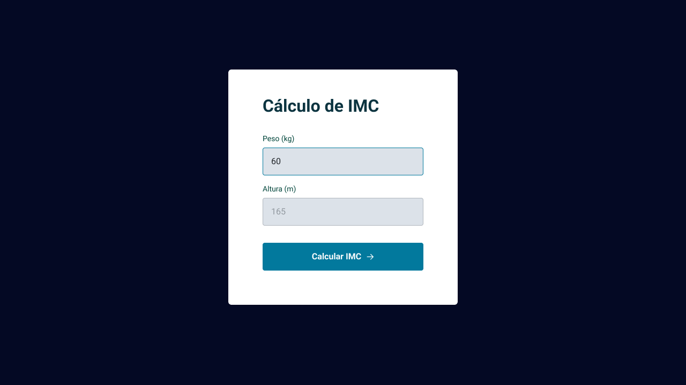

<h1 align="center">Calculadora de IMC 🧮</h1>

Calculadora de IMC

  <a href="#-tecnologias">Tecnologias</a>&nbsp;&nbsp;&nbsp;|&nbsp;&nbsp;&nbsp;
  <a href="#-projeto">Projeto</a>&nbsp;&nbsp;&nbsp;
  

 

  

## 🚀 Tecnologias

Esse projeto foi desenvolvido com as seguintes tecnologias:

- HTML e CSS
- JavaScript
- Git e Github
- Figma

## 💻 Projeto

A página de Calculadora de IMC foi desenvolvida para estudo do JavaScript.

- [Acesse o projeto finalizado, online](https://viniciuszmota.github.io/calculadora-de-IMC/)

---

Feito com ♥ by Vinicius Zamprogno Mota, estudante na Rocketseat 👋
